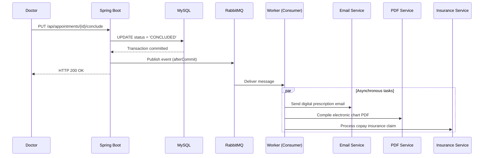

# 🏥 MedConnect - Clinical Management System

[](https://www.oracle.com/java/technologies/downloads/)
[](https://spring.io/projects/spring-boot)
[](https://www.rabbitmq.com/)
[](https://www.mysql.com/)
[](https://flywaydb.org/)
[](https://swagger.io/)

MedConnect is a robust, production-grade clinical ecosystem designed to handle multi-role healthcare operations seamlessly. Built upon an **Event-Driven Architecture (EDA)**, the application isolates time-consuming background processing (such as automated digital prescription dispatching, medical record charting, and insurance billing) from synchronous HTTP communication loops using a specialized message broker.

---

## 🏗️ Architectural Pillars & Patterns

* **Decoupled Multi-Role Security:** Granular method-level access authority mapping (`ROLE_PATIENT`, `ROLE_DOCTOR`) enforced via Spring Security interceptor filter chains.
* **Transactional Message Pipeline:** Strict data synchronization guarantees preventing race conditions by delaying message execution until after database transaction commits.
* **Database Governance:** Complete deprecation of arbitrary Hibernate state modifiers (`ddl-auto=validate`) in favor of deterministic SQL script iteration managed through Flyway Migrations.
* **Asynchronous Parallelism:** Offloading non-blocking outbound tasks to background worker pools running inside isolated execution contexts using RabbitMQ.

---

## 💾 Relational Data Model & Schemas

The database schema is strictly structured using standard foreign key rules and specific relational constraints (`ON DELETE RESTRICT`) to avoid orphan data anomalies. 

### Entity-Relationship Diagram (Conceptual Layout)

```text
  ┌─────────────┐          ┌───────────────────┐          ┌─────────────┐
  │  patients   │ 1      * │   appointments    │ *      1 │   doctors   │
  ├─────────────┤ ──────── ├───────────────────┤ ──────── ├─────────────┤
  │ id (PK)     │          │ id (PK)           │          │ id (PK)     │
  │ name        │          │ patient_id (FK)   │          │ name        │
  │ email (UK)  │          │ doctor_id (FK)    │          │ email (UK)  │
  │ cpf (UK)    │          │ appointment_date  │          │ crm (UK)    │
  │ phone       │          │ status (ENUM)     │          │ specialty   │
  │ password    │          │ created_at        │          │ password    │
  │ role        │          └───────────────────┘          │ role        │
  └─────────────┘                                         └─────────────┘
```
---
Table Definitions (Flyway Migration Baseline)
### `patients`

| Coluna     | Tipo          | Restrições                         |
|------------|---------------|------------------------------------|
| id         | INT           | PRIMARY KEY AUTO_INCREMENT         |
| name       | VARCHAR(100)  | NOT NULL                           |
| email      | VARCHAR(100)  | NOT NULL, UNIQUE                   |
| cpf        | VARCHAR(14)   | NOT NULL, UNIQUE                   |
| phone      | VARCHAR(20)   |                                    |
| role       | VARCHAR(20)   | NOT NULL DEFAULT 'ROLE_PATIENT'    |
| password   | VARCHAR(255)  | NOT NULL                           |

### `doctors`

| Coluna     | Tipo                                          | Restrições                               |
|------------|-----------------------------------------------|------------------------------------------|
| id         | INT                                           | PRIMARY KEY AUTO_INCREMENT               |
| name       | VARCHAR(100)                                  | NOT NULL                                 |
| email      | VARCHAR(100)                                  | NOT NULL, UNIQUE                         |
| crm        | VARCHAR(20)                                   | NOT NULL, UNIQUE                         |
| specialty  | ENUM('CARDIOLOGY','DERMATOLOGY','NEUROLOGY','PEDIATRICS') | NOT NULL                    |
| role       | VARCHAR(20)                                   | NOT NULL DEFAULT 'ROLE_DOCTOR'           |
| password   | VARCHAR(255)                                  | NOT NULL                                 |

### `appointments`

| Coluna            | Tipo                                                       | Restrições                                               |
|-------------------|------------------------------------------------------------|----------------------------------------------------------|
| id                | INT                                                        | PRIMARY KEY AUTO_INCREMENT                               |
| patient_id        | INT                                                        | NOT NULL, FOREIGN KEY REFERENCES `patients(id)`         |
| doctor_id         | INT                                                        | NOT NULL, FOREIGN KEY REFERENCES `doctors(id)`          |
| appointment_date  | TIMESTAMP                                                  | NOT NULL                                                 |
| status            | ENUM('PENDING','CONFIRMED','CONCLUDED','CANCELED')        | NOT NULL DEFAULT 'PENDING'                               |
| created_at        | TIMESTAMP                                                  | NOT NULL DEFAULT CURRENT_TIMESTAMP                       |

📡 Core API Lifecycle & Access Specifications
All primary request payloads utilize immutable Java Records acting as clean Data Transfer Objects (DTOs) to secure domain boundaries.

---
| Método | Endpoint                               | Roles               | Resposta | Descrição                          |
|--------|----------------------------------------|---------------------|----------|------------------------------------|
| POST   | `/api/patients`                        | 🟢 `PermitAll`      | 201      | Cadastrar paciente                 |
| POST   | `/api/doctors`                         | 🟢 `PermitAll`      | 201      | Cadastrar médico                   |
| POST   | `/api/appointments`                    | 🔵 `ROLE_PATIENT`   | 201      | Criar agendamento (status PENDING) |
| PUT    | `/api/appointments/{id}/conclude`      | 🔴 `ROLE_DOCTOR`    | 200      | Concluir consulta → fila assíncrona |
---
## 🔄 Asynchronous Workflow Mechanics

When a doctor triggers a consultation conclusion (`PUT /api/appointments/{id}/conclude`), MedConnect utilizes a decoupled event flow:


This configuration ensures that if the database write slows down or experiences a rollback, no dead or phantom messages are dispatched to the message broker.

🚀 Environment Infrastructure Setup
Prerequisites
Docker Desktop / Docker Compose Engine installed.

Java Development Kit (JDK) 17 or higher.

1. Boot up Infrastructure Services
In the root directory of the project, execute the orchestrator compose file:
```bash
docker compose up -d
```
This initializes:

MySQL DB at localhost:3306

phpMyAdmin Utility accessible at http://localhost:8081 (Credentials: meduser / medpassword)

RabbitMQ Cluster UI accessible at http://localhost:15672 (Credentials: guest / guest)

2. Run the Spring Application
Execute the following command using the Maven Wrapper script to perform continuous migration verification and launch the backend web server:

```bash
./mvnw spring-boot:run
```
The application context will bind to port 8080.

3. Review Interactive System API Documentation
Once the server boot log completes, navigate to the local Open API suite interface to inspect endpoints, check JSON request structures, or perform dynamic route testing:
👉 http://localhost:8080/swagger-ui/index.html

## 🧪 Automated Testing Strategy

The application adopts a pyramid-testing strategy split into two distinct execution layers to ensure business compliance and high regression resilience.

### 1. Unit Testing Layer (Isolated Domain Behavior)
* **Scope:** Business logic validation inside `AppointmentService`.
* **Stack:** **JUnit 5** & **Mockito**.
* **Mechanics:** Database repositories (`PatientRepository`, `DoctorRepository`, `AppointmentRepository`) and the message broker interface (`RabbitTemplate`) are completely mocked using `@Mock`. This layout completely decouples the test suite from active external networking or database layers.
* **Core Test Cases:**
  * Successful registration maps inputs correctly and triggers transactional messaging pipelines.
  * Attempting lookups on non-existent identifiers safely triggers explicit `NotFoundException` handling blocks.

### 2. Integration Testing Layer (End-to-End API Contracts)
* **Scope:** Controller routing, payload validation engines, HTTP status code bindings, and global exception mapping filters.
* **Stack:** `@SpringBootTest` with **MockMvc**.
* **Mechanics:** Spins up a mock servlet context web environment to fire real HTTP requests against endpoints without running a physical browser.
* **Core Test Cases:**
  * Verifying that invalid data structures (e.g., negative appointment values or blank strings) are blocked by the Validation engine, returning an `HTTP 422 Unprocessable Entity`.
  * Guaranteeing that resource restrictions trigger an automatic `HTTP 403 Forbidden` if an unauthorized role hits specific administrative routes.
